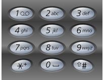

# leetcode-algorithms-17 Letter Combinations of a Phone Number

Given a string containing digits from 2-9 inclusive, return all possible letter combinations that the number could represent.

A mapping of digit to letters (just like on the telephone buttons) is given below. Note that 1 does not map to any letters.



Example:

Input: "23"
Output: ["ad", "ae", "af", "bd", "be", "bf", "cd", "ce", "cf"].
Note:

Although the above answer is in lexicographical order, your answer could be in any order you want.

## 解法

通过数字对应的字符串,循环.
```
class Solution
{
public:
    vector<string> letterCombinations(string digits)
    {
        std::vector<std::string> result;
        if (digits.empty()) return result;
        
        result = {""};
        std::vector<std::string> v = {"", "", "abc", "def", "ghi", "jkl", "mno", "pqrs", "tuv", "wxyz"};
        for(int i = 0 ; i < digits.size(); ++i)
        {
            int num = digits[i] - '0';
            if(num < 0 || num > 9)
                break;

            std::string cand = v[num];
            if(cand.empty())
                continue;
        
            std::vector<std::string> tmp = result;
            result.clear();
            for(int j = 0; j < tmp.size(); ++j)
            {
                for(int k = 0; k < cand.size(); ++k)             
                    result.push_back(tmp[j] + cand[k]);
            }
        }
        return result;        
    }
};
```