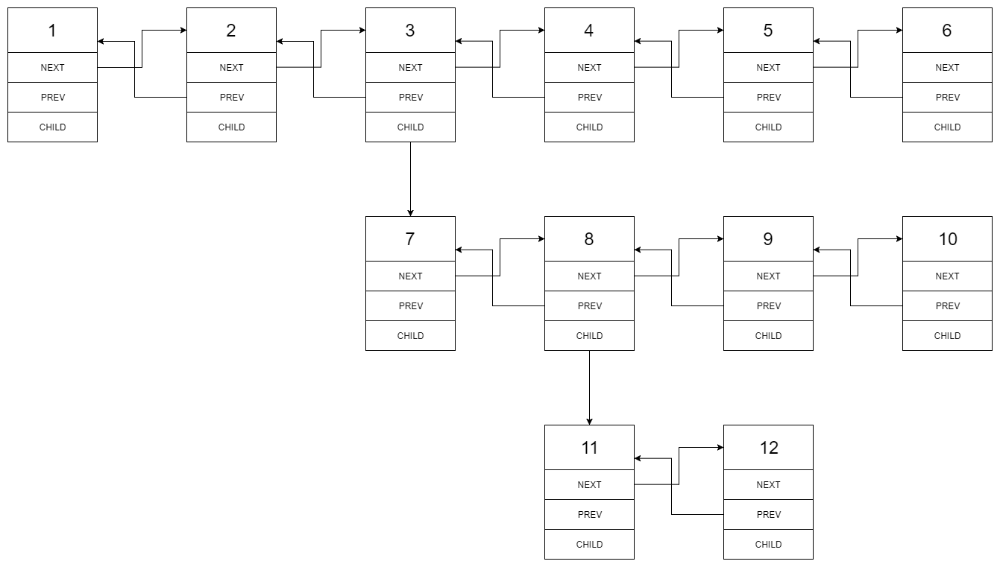
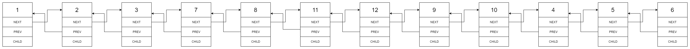

# leetcode-algorithms-430 Flatten a Multilevel Doubly Linked List

You are given a doubly linked list which in addition to the next and previous pointers, it could have a child pointer, which may or may not point to a separate doubly linked list. These child lists may have one or more children of their own, and so on, to produce a multilevel data structure, as shown in the example below.

Flatten the list so that all the nodes appear in a single-level, doubly linked list. You are given the head of the first level of the list.

## Example:

```
Input:
 1---2---3---4---5---6--NULL
         |
         7---8---9---10--NULL
             |
             11--12--NULL

Output:
1-2-3-7-8-11-12-9-10-4-5-6-NULL
```

Explanation for the above example:

Given the following multilevel doubly linked list:

 

We should return the following flattened doubly linked list:



## 解法

```
/*
// Definition for a Node.
class Node {
public:
    int val;
    Node* prev;
    Node* next;
    Node* child;

    Node() {}

    Node(int _val, Node* _prev, Node* _next, Node* _child) {
        val = _val;
        prev = _prev;
        next = _next;
        child = _child;
    }
};
*/
class Solution {
public:
    Node* flatten(Node* head) {
        Node *curr = head;
        while (curr != nullptr) {
            // no child
            if (curr->child == nullptr) {
                curr = curr->next;
                continue;
            }
            
            Node *child = curr->child;
            Node *last = child;
            // find the last node in child
            while(last->next != nullptr)
                last = last->next;
            
            // child join to the link.
            Node *next = curr->next;
            curr->next = child;
            child->prev = curr;
            
            last->next = next;
            if (next != nullptr)
                next->prev = last;
            
            curr->child = nullptr;
            curr = curr->next;
        }
        return head;        
    }
};
```